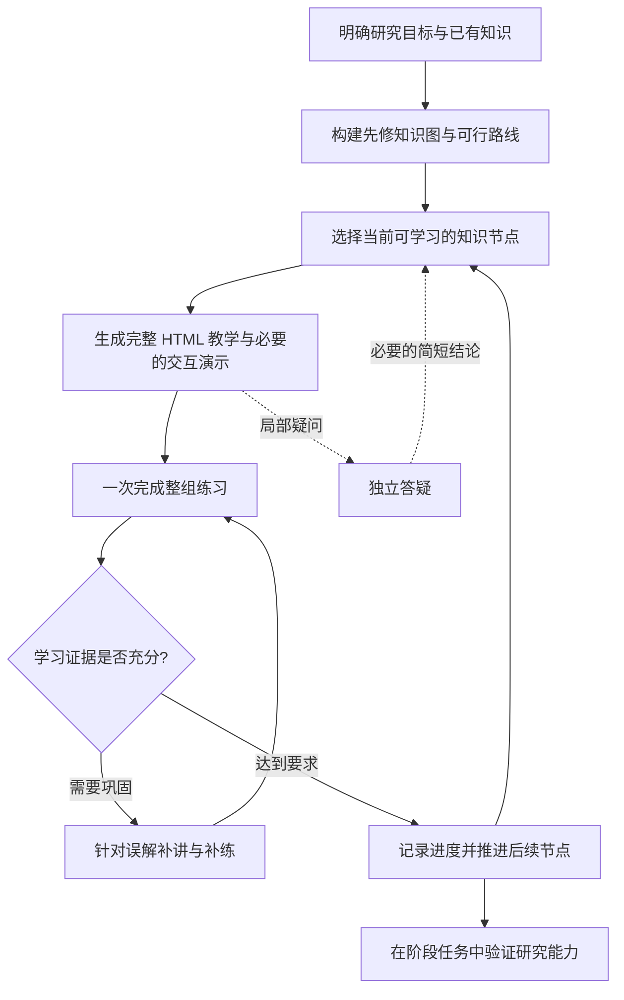

# KnowBridge

**从你已经会的知识出发，搭一座通向陌生研究领域的桥。**

KnowBridge 是一个面向 AI agent 的学习 skill。它尤其关注本科生进入课题组、阅读论文和参与研究项目时，课堂知识与实际研究任务之间的距离。

## 为什么做这个项目

对于现在的本科生，进入课题组做项目往往意味着突然面对一整套课堂上从未接触过的知识：论文中的方法、代码中的实现、实验中的指标，以及这些内容背后隐藏的先修概念。目标看似明确，却不知道从自己已经学过的地方，怎样一步步走过去。

向 AI 发起一次“给我讲讲这个领域”的对话，通常可以得到概览，却很难同时获得足够细致的讲解、合适的先修顺序、理解程度的检验，以及持续推进的学习过程。遇到不懂的地方反复追问，还容易让原本的学习主线淹没在越来越长的对话里。

KnowBridge 想把这个过程组织起来：**先了解学习者已经知道什么，再围绕具体目标构建知识桥梁。桥梁由一个个知识节点组成，每个节点都有细致教学与配套练习；通过学习证据判断是否需要补充、巩固或向前推进，直到学习者能够完成最初的研究任务。**

“学完一个陌生领域”在这里需要落到可验证的目标上，例如读懂论文中的关键方法、解释项目中的一段实现，或完成一个小型实验。课程范围和深度随目标调整。

## 学习怎样推进



知识图可以有多个先修分支。学习路线依据目标、基础和练习表现生成，不预设每个人都走同一条路径，也不宣称生成的路线必然完整或最优。

## 当前能力

- **从已有知识开始。** 获取背景、目标和限制；使用一次可跳过的批量诊断，避免无休止地逐题询问。
- **按知识节点细讲。** 每节课包含动机、符号定义、推导或解释、完整例子、常见误解与迁移边界，能够独立阅读。
- **用 HTML 承载学习体验。** 提供课程目录、阅读位置恢复、明暗主题和适配窄屏的布局；需要时加入参数实验、过程演示或自定义可视化。
- **用整组题目检验理解。** 预设 HTML 答题模板，支持单选、多选、数值和开放题，保存草稿并导出答案。
- **依据证据推进。** 客观题在本地批量判题；证明、解释和代码按评价标准审阅。错题用于定位误解和补讲，学习进度可以跨会话保留。
- **让细节答疑独立发生。** 在段落、选中文字或题目旁准备带少量背景的提问，用 side chat 或独立聊天讨论；只有影响主线的结论才简短带回。
- **复用模板，保留教学深度。** 页面布局、交互控件和判题由模板与脚本承担，让 agent 的生成量更多用于真正需要解释的内容。

默认每节课提供 5–10 道练习，而不是每轮只问一道题。页面阅读、答案导出和接受过解释都不会自动成为“已掌握”的证据。

## 使用方式

将 [`skills/knowbridge`](skills/knowbridge) 作为完整的 skill 目录安装到支持 skills 的 agent 环境中。不要只复制 `SKILL.md`；教学模板和脚本也属于 skill 的一部分。

例如，可以从这样一个请求开始：

> 使用 $knowbridge。我学过线性代数，会写 Python，但没有系统学过大语言模型。现在想参与一个 KV cache 压缩项目，希望最终能读懂指定论文中的方法并跑通一个最小实验。请先根据我的已有知识搭建学习路线，按节点生成细致的 HTML 课程和完整题组。

也可以直接给出目标论文、仓库或项目说明。agent 会检查相关材料，把任务要求转成所需知识节点。默认把学习档案、课程页面、题目、提交和进度保存在当前项目的 `knowbridge/` 中。

### 体验模板

生成一个独立示例目录：

```sh
python skills/knowbridge/scripts/preview.py ./knowbridge-preview
```

打开 `knowbridge-preview/index.html`，即可体验课程与练习页面。示例包括可调权重的计算演示、可暂停的步骤动画和完整题组，不写入正式学习进度。

如果浏览器预览需要本地网页地址，可运行：

```sh
python -m http.server 8000 --bind 127.0.0.1 --directory knowbridge-preview
```

然后访问 `http://127.0.0.1:8000`。生成、判题与默认网页模板使用 Python 标准库和原生 HTML/CSS/JavaScript，不需要额外的前端框架或在线模型 API。

### Side chat 的实际入口

页面中的“对此处提问”会准备当前目标、已有基础、段落或题号、相关原文与问题。它提供 `/side` 命令和提问正文的复制入口：在支持该命令的客户端中粘贴并发送；否则打开独立聊天并粘贴正文。

静态 HTML 本身不会直接创建聊天或发送消息。答疑是否使用原生 side chat 取决于客户端支持，完整使用规则见 [`references/side-chat.md`](skills/knowbridge/references/side-chat.md)。

## 仓库结构

```text
skills/knowbridge/
├── SKILL.md              # 核心教学与推进规则
├── agents/openai.yaml    # skill 的界面信息
├── references/           # 按需读取的编写与答疑契约
├── scripts/
│   ├── build.py          # 生成课程、题组与路线页面
│   ├── grade.py          # 客观题本地批量判题
│   └── preview.py        # 生成隔离的模板示例
└── assets/
    ├── web/              # 可复用的网页与交互模板
    └── examples/         # 教学片段、题目和答案格式示例
```

生成新节点与提交答案的格式见 [`references/authoring.md`](skills/knowbridge/references/authoring.md)。正式课程的答案钥匙保存在单独文件中，不嵌入答题网页；本地判题也会检查版本化提交是否对应当前题组。

## 希望达成的体验

学习者不必在“只得到一个概览”和“不断追问却失去方向”之间反复切换。打开当前节点，就能系统地学习、尝试、提问与验证；回到主线时，仍然知道自己在桥的哪一段，下一步要跨向哪里。
